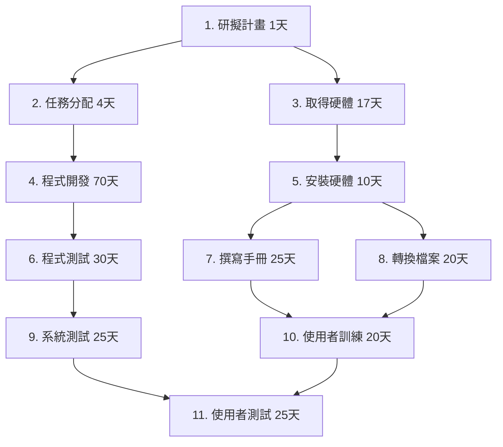
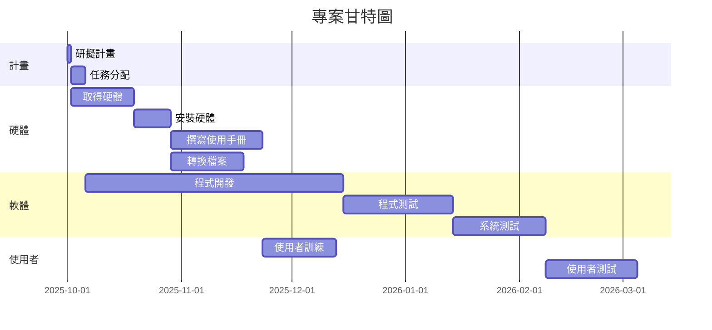

# 📄 hw2.md

## (1) 任務及任務模式

| 任務 | 說明         | 需時 (天) | 前置任務 |
|------|--------------|-----------|----------|
| 1    | 研擬計畫     | 1         | -        |
| 2    | 任務分配     | 4         | 1        |
| 3    | 取得硬體     | 17        | 1        |
| 4    | 程式開發     | 70        | 2        |
| 5    | 安裝硬體     | 10        | 3        |
| 6    | 程式測試     | 30        | 4        |
| 7    | 撰寫使用手冊 | 25        | 5        |
| 8    | 轉換檔案     | 20        | 5        |
| 9    | 系統測試     | 25        | 6        |
| 10   | 使用者訓練   | 20        | 7, 8     |
| 11   | 使用者測試   | 25        | 9, 10    |

---

## (2) PERT/CPM 圖

---

## (3) 甘特圖（含開始與結束時間）

假設專案開始日為 **2025-10-01**：

---

## (4) 關鍵路徑

依賴關係與工期計算：

- 1 (1天)  
- 2 (4天)  
- 4 (70天)  
- 6 (30天)  
- 9 (25天)  
- 11 (25天)  

➡️ **關鍵路徑：1 → 2 → 4 → 6 → 9 → 11**  
➡️ **總工期 = 155 天**
